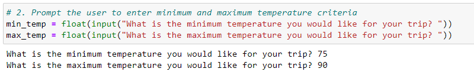
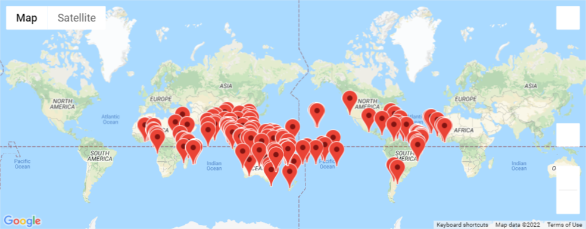
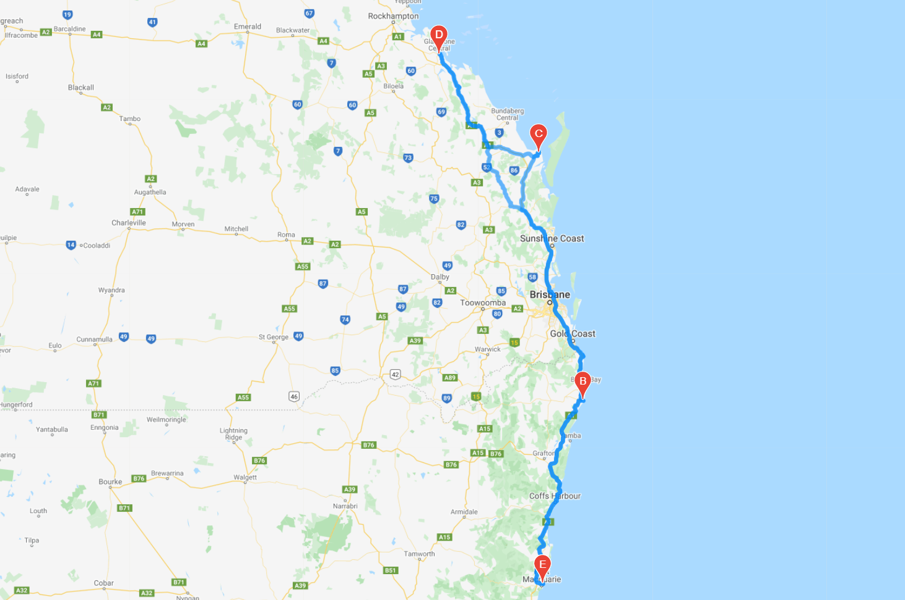
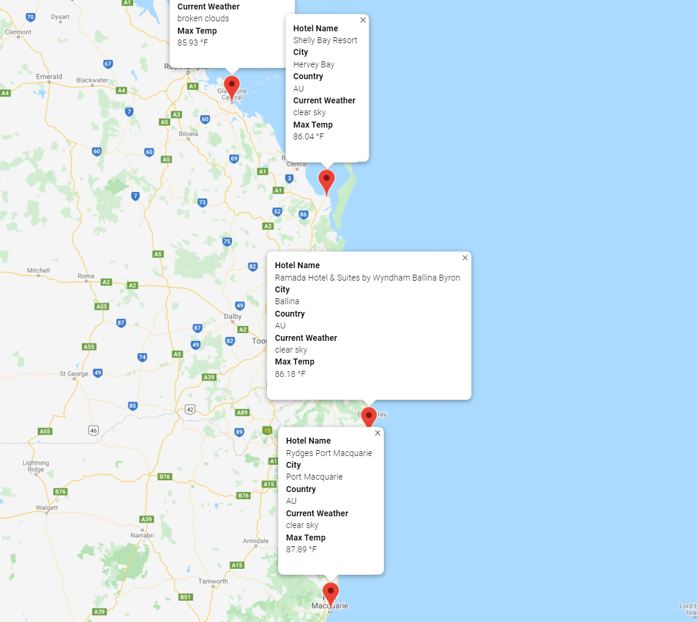

# World_Weather_Analysis
Module 6 World Weather Analysis

## Overview of the World Weather Analysis Project
The purpose of the World Weather Analysis project was to retrieve weather data at various locations across the world to inform customer travel destinations and a travel itinerary.

## Results
The results of this analysis included the following: 
- A vacation Search function that allows the customer to identify minimum and maximum temperatures for the vacation destination (image 1)
- A vacation map with markers on hundreds of potential vacations which identifies weather attributes such as temperature and current description (image 2)
- A vacation itinerary travel map which indicates travel route between 4 vacation destinations (image 3)
- A refined vacation map with markers on the four selected vacation destinations and includes information such as hotel name, city, country, current weather, and max temp (image 4)

### Image 1

### Image 2

### Image 3

### Image 4

## Summary 
The World Weather Analysis created a baseline process for identifying potential vacation destinations, incorporating customer input, mapping the itinerary and route, and including markers with destination information.
